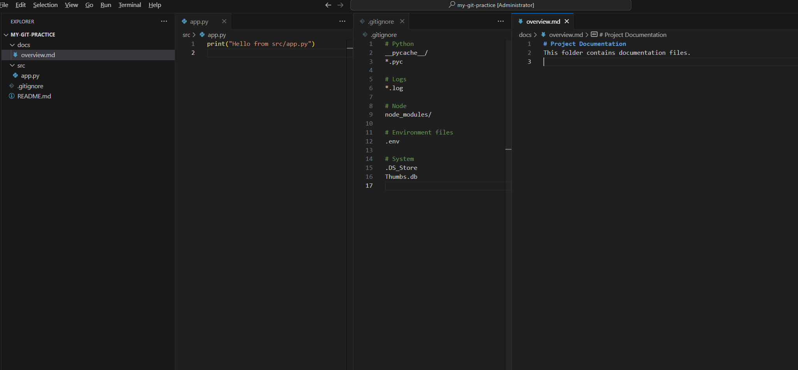

# My Git Practice

Стислий опис
Цей репозиторій створено для практичного ознайомлення з основними командами Git та GitHub.  
Він містить приклади створення репозиторію, комітів, роботи з гілками та README-файлом.

##Призначення
Навчитись створювати, редагувати та синхронізувати проєкти з GitHub, працювати з гілками та файлами.

##Автор
Дмитро Терніков(Dmitry424), ХКФК П-31

##Мета
Ознайомитись із повним циклом роботи з системою контролю версій Git і платформою GitHub.

##Функціонал
- Створення локального репозиторію
- Зв’язування з віддаленим репозиторієм через SSH
- Коміти, гілки, merge, push
- Робота з README та .gitignore
- Виконання навчального завдання для практики

##Інструкція запуску
1. Завантажити репозиторій:
   ```bash
   git clone git@github.com:Dmitry424/my-git-practice.git

## Preview
